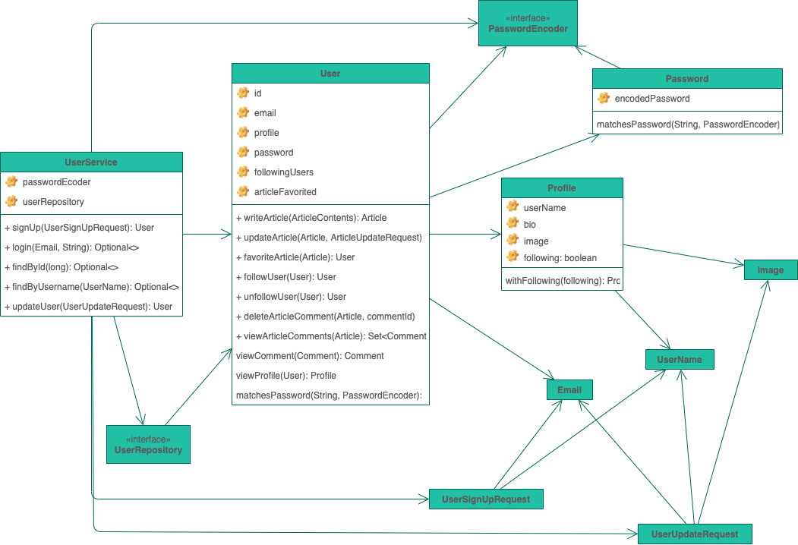
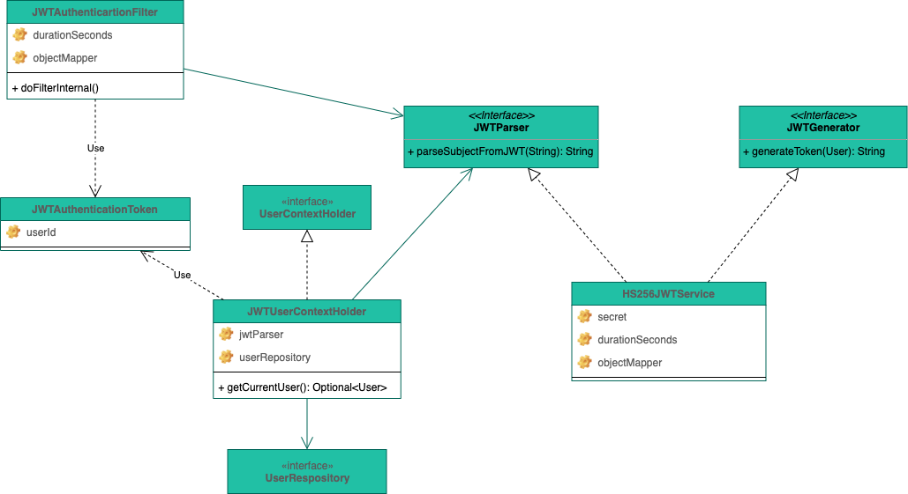
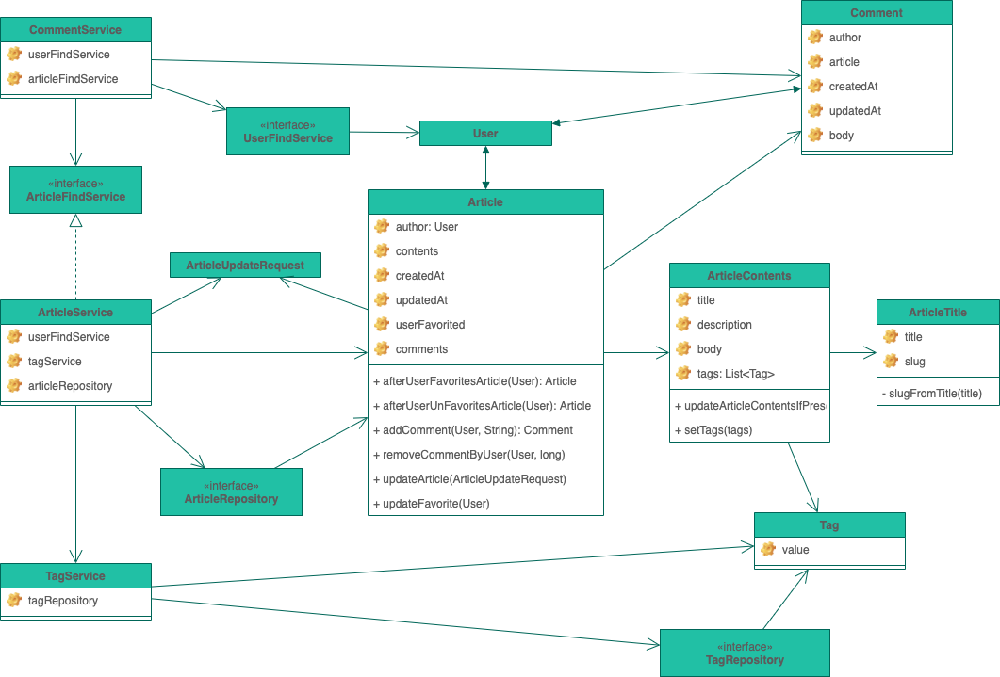
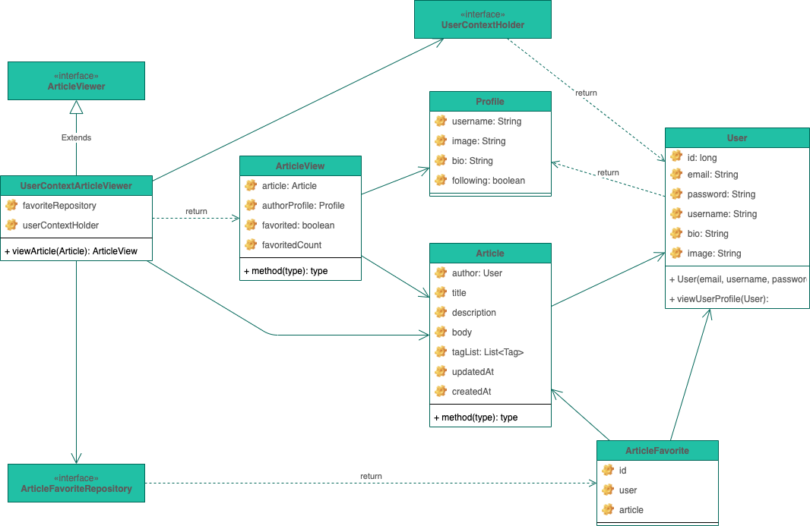
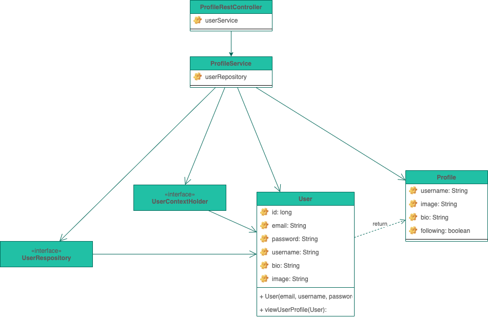

[](https://github.com/raeperd/realworld-springboot-java/actions/workflows/build.yml)
[](https://sonarcloud.io/dashboard?id=raeperd_realworld-springboot-java)
[](https://sonarcloud.io/dashboard?id=raeperd_realworld-springboot-java)
[](https://sonarcloud.io/dashboard?id=raeperd_realworld-springboot-java)
[](https://opensource.org/licenses/MIT)

[ReadWorld.io](https://github.com/gothinkster/realworld) backend project using spring boot java using `spring-security`, `spring-data-jpa`

# Insprired by

- [우아한형제들 기술 불로그 | Todo list 만들기는 이제 그만](https://woowabros.github.io/experience/2020/04/14/stop-making-todo-list.html)
- [우아한형제들 기술 블로그 | Gradle 프로젝트에 JaCoCo 설정하기](https://woowabros.github.io/experience/2020/02/02/jacoco-config-on-gradle-project.html)
- [우아한형제들 기술 블로그 | 우린 Git-flow를 사용하고 있어요](https://woowabros.github.io/experience/2017/10/30/baemin-mobile-git-branch-strategy.html)
- [Github | Realworld.io](https://github.com/gothinkster/realworld)


 # Getting started

 ## Build from scratch
 ``` shell
 $ ./gradlew build bootRun
 ```

 ## Using docker
 ``` shell
 $ docker run --rm -p 8080:8080 raeperd/realworld-spring-boot-java
 ```

- Dockerhub registry is [here](https://hub.docker.com/repository/docker/raeperd/realworld-spring-boot-java)  
- Container tags are simply branch name of this repository following git-flow strategy


## How to test 

After run application, you can try one of followings

### using shell script

``` shell
$ ./doc/run-api-tests.sh
```

### using postman 

Import [`./doc/Conduit.postman_collection.json`](./doc/Conduit.postman_collection.json) in your postman application 


And also, pure `gradle test` covers almost every lines of code.

More details can be found in [`./doc/README.md`](./doc/README.md) and  [original source](https://github.com/gothinkster/realworld/tree/master/spec)

# Architecture overview

## Design Principal

- Always `final` whenever possible
- Always pacakage private class whenever possible
- **Always test every package, class, method, insturction in codes**
  - Except for some boilerplate `equals` and `hashcode` method
  - This is validated by [jacoco-gradle-plugin](https://docs.gradle.org/current/userguide/jacoco_plugin.html).
  - Coverage verification in [`./test.gradle`](./test.gradle)
- Try to avoid including additional dependencies as much as possbile
  - Implements JWT generation / validation logic without 3rd party library [#3](https://github.com/raeperd/realworld-springboot-java/issues/3)
- Try to maintiain codes in domain package to keep POJO
  - Except for special spring annotations like `@Service`, `@Repository`
  - Not to use lombok in domain pacakge classes


## Diagrams 

- You can open full diagram file in [`realworld.drawio`](./realworld.drawio) using [draw.io](https://app.diagrams.net/)

### User



- Separate interface for `JWTGenerator` and `JWTParser`
- Try to do everything in `UserService`

### JWT 



- Try not to use 3rd party library
- Context from JWT token can be retrieved using `UserContextHolder` implemtation
- `HS256JWTService` do core logic
  - Symmetric JWT token signing using HS256 (includes Base64URL, SHA256) 
  - Validate given token 

### Article



- Separate `@Entity` with `ArticleView` class 
- Favorite of articles is another `@Entity`
- `ArticleView` contains run-time information about `Article`

### ArticleView




### Profile



- Profile as sperate service since it is used widely 


# What can be done

- More strict validation in application layer
- Profile view logic can be imporved.
- JWT Token can be improved
  - JWTToken should not contains userid. 
  - Current version of JWT authentication is somewhat imperfact.
  - More details in [Stop using JWT for sessions](http://cryto.net/~joepie91/blog/2016/06/13/stop-using-jwt-for-sessions/) 

# Contact

You can contact me with [email](raeperd117@gmail.com) or issue in this project

# License
[MIT License](./LICENSE)

# Referenced

- [JSON Web Token Introduction - jwt.io](https://jwt.io/introduction)

- [Symmetric vs Asymmetric JWTs. What is JWT? | by Swayam Raina | Noteworthy - The Journal Blog](https://blog.usejournal.com/symmetric-vs-asymmetric-jwts-bd5d1a9567f6)
- [presentations/auth.md at master · alex996/presentations · GitHub](https://github.com/alex996/presentations/blob/master/auth.md)

